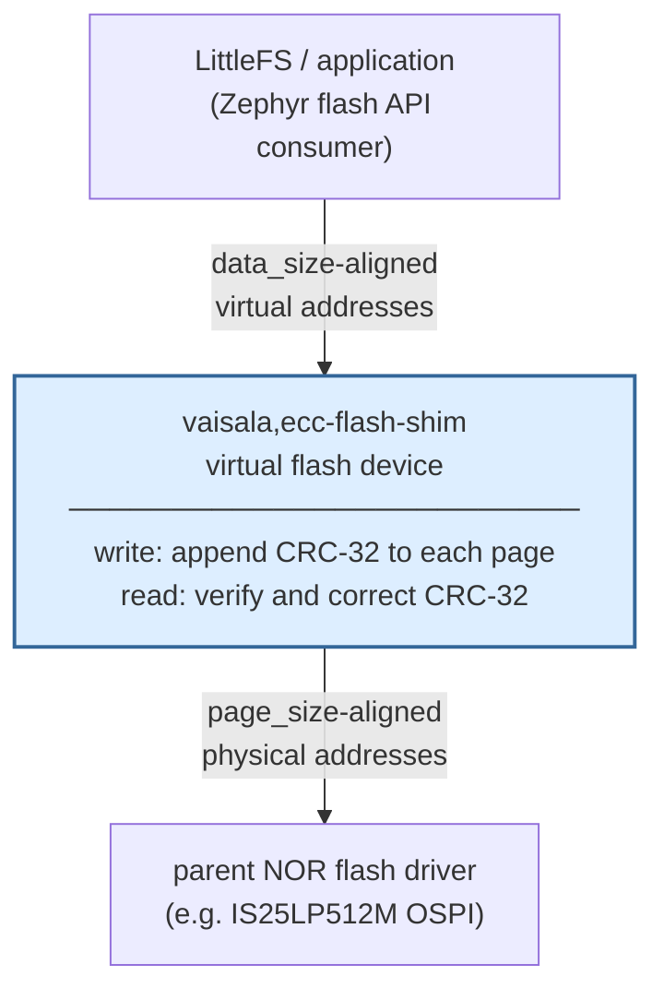

# flash-ecc

Zephyr out-of-tree module providing software ECC for NOR flash storage.
Intended for use below a LittleFS filesystem on devices where the flash
hardware does not provide ECC.

## Contents

```
flash-ecc/
├── lib/ecc_crc32/        Portable CRC-32 error detection and correction library
├── drivers/flash/        Zephyr flash shim driver (vaisala,ecc-flash-shim)
├── include/ecc_crc32.h   Public API for the ECC library
├── dts/bindings/         Device tree binding for the shim driver
└── tests/ecc_crc32/      Unit tests for the ECC library (Zephyr ztest)
```

## How it works

Each physical NOR flash page is split into a data payload and a 4-byte
CRC-32. The payload size is configurable via the `data-size` DT property
(default 252, giving a 256-byte physical page):

```
┌─────────────────────────────────────────────────┬─────────────────┐
│           data-size bytes data (default 252)    │  4 bytes CRC-32 │
└─────────────────────────────────────────────────┴─────────────────┘
 byte 0                                        251 252            255
```

Per physical erase sector (`pages-per-sector` pages, default 16):
- **4032 bytes** usable data visible to upper layers (16 × 252, default)
- 64 bytes CRC-32 overhead (1.56%)

The CRC-32 uses the standard IEEE polynomial (`0xEDB88320` reflected),
provided by Zephyr's `crc32_ieee()`. For the default 252-byte data payload
the CRC-32 Hamming distance guarantees:

| Errors | Capability |
|--------|------------|
| 1 bit  | Correct    |
| 2 bits | Correct¹   |
| 3 bits | Detect     |
| 4+ bits| Detect most|

¹ Requires `CONFIG_ECC_CRC32_2BIT_CORRECTION=y` (default off). Without it,
2-bit errors are detected and reported as uncorrectable.

2-bit correction is possible because the default 256-byte codeword (252 + 4)
is within the 371-byte HD=5 limit for this polynomial. Custom `data-size`
values must satisfy `data-size ≤ 367` to stay within this limit. See
[Koopman's CRC database](https://users.ece.cmu.edu/~koopman/crc/crc32.html)
for details.

The correction algorithm is adapted from
[littlefs-project/ramcrc32bd](https://github.com/littlefs-project/ramcrc32bd).
It avoids recomputing the full CRC for each candidate bit position by
deriving CRC contributions incrementally via the polynomial LFSR shift
relation. The inner loop is pure XOR and shift — no CRC recomputation.

## Zephyr flash shim driver



The shim driver (`vaisala,ecc-flash-shim`) wraps a parent flash device and
presents a virtual flash device to upper layers with:

- `write_block_size` = `data-size` bytes (default 252)
- Virtual sector = `data-size × pages-per-sector` bytes (default 4032, maps 1:1 to a physical 4096-byte erase sector)

All ECC encoding and decoding is transparent. Corrected errors are logged:

- 1-bit correction: `LOG_WRN`
- 2-bit correction: `LOG_ERR` (requires `CONFIG_ECC_CRC32_2BIT_CORRECTION=y`)
- Uncorrectable error: `LOG_ERR`, returns `-EFAULT`

Erased pages (all `0xFF`) are returned as-is without an ECC check.

### Memory footprint

Each enabled driver instance owns one static scratch buffer of
`data_size + ECC_SHIM_CRC_SIZE` bytes (256 bytes for the default `data-size = 252`).
The buffer is allocated in `.bss` alongside the `ecc_shim_data` struct; no
heap is used.

The buffer cannot be eliminated because the physical and virtual page layouts
are incompatible:

- **Read**: the physical page is `[data | CRC]`; the CRC must be verified
  before the data bytes reach the caller, requiring a temporary holding area
  for the full physical page.
- **Write**: the caller's buffer is `const` and sized to `data_size` only —
  there is no room to append the CRC in place.

Read and write paths therefore add no dynamic stack usage for the page data.

### LittleFS configuration

Configure LittleFS via a DT fstab node. `read-size` and `prog-size` must
equal the shim's `data-size` (default 252) so that every read and write
aligns to a complete ECC page:

```dts
/ {
    fstab {
        compatible = "zephyr,fstab";
        lfs1: lfs1 {
            compatible = "zephyr,fstab,littlefs";
            mount-point = "/lfs1";
            partition = <&storage_partition>;
            automount;
            read-size = <252>;      /* must equal shim data-size */
            prog-size = <252>;      /* must equal shim data-size */
            cache-size = <252>;
            lookahead-size = <512>; /* block_count / 8 */
            block-cycles = <512>;
        };
    };
};
```

Reference the fstab entry in application code:

```c
FS_FSTAB_DECLARE_ENTRY(DT_NODELABEL(lfs1));
#define littlefs_mnt FS_FSTAB_ENTRY(DT_NODELABEL(lfs1))

fs_mount(&littlefs_mnt);
```

`block_size` and `block_count` are derived automatically at mount time from
the shim's flash page layout — do not set them in the fstab node.

**Heap size.** With `cache-size = <252>`, each open file allocates 252 bytes
from the per-file cache heap. Set `CONFIG_FS_LITTLEFS_FC_HEAP_SIZE` to cover
the maximum number of simultaneously open files:

```kconfig
# (252 + 32 overhead) * max_open_files
CONFIG_FS_LITTLEFS_FC_HEAP_SIZE=5120
```

## Integration

### west.yml

Add to your west manifest:

```yaml
- name: flash-ecc
  remote: <your-remote>
  path: modules/lib/flash-ecc
  revision: <commit hash>
```

### Kconfig

```kconfig
CONFIG_FLASH_ECC_SHIM=y
```

This automatically selects `CONFIG_ECC_CRC32` and `CONFIG_FLASH_PAGE_LAYOUT`.

To enable 2-bit error correction (disabled by default, see warning in Kconfig help):

```kconfig
CONFIG_ECC_CRC32_2BIT_CORRECTION=y
```

### Device tree

```dts
ecc_flash: ecc-flash-shim {
    compatible = "vaisala,ecc-flash-shim";
    parent-flash = <&your_nor_flash>;
    status = "okay";

    /* data-size and pages-per-sector default to 252 and 16 (standard
     * 256-byte/4096-byte NOR flash). Override only for non-standard geometry:
     *   data-size = <252>;
     *   pages-per-sector = <16>;
     */

    partitions {
        compatible = "fixed-partitions";
        #address-cells = <1>;
        #size-cells = <1>;

        /* 4096 virtual sectors × 4032 bytes = 0xFC0000 (default geometry) */
        storage_partition: partition@0 {
            label = "storage";
            reg = <0x0 0xFC0000>;
        };
    };
};
```

## Building and running tests

```bash
west build -b native_sim tests/ecc_crc32
west build -t run
```

## License

BSD 3-Clause. See [LICENSE](LICENSE).

The correction algorithm is adapted from
[littlefs-project/ramcrc32bd](https://github.com/littlefs-project/ramcrc32bd),
Copyright (c) 2024, The littlefs authors, BSD-3-Clause.
